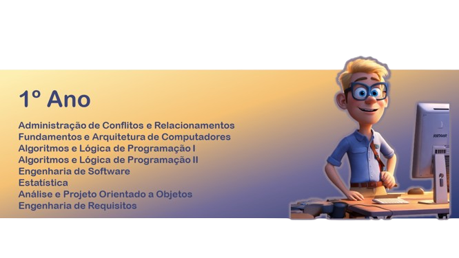
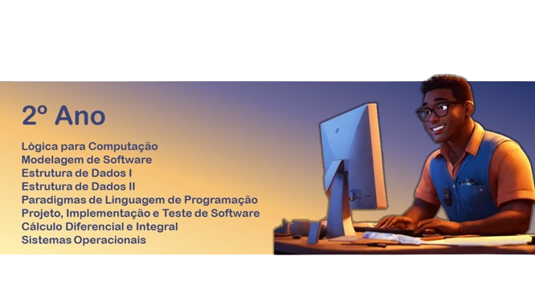
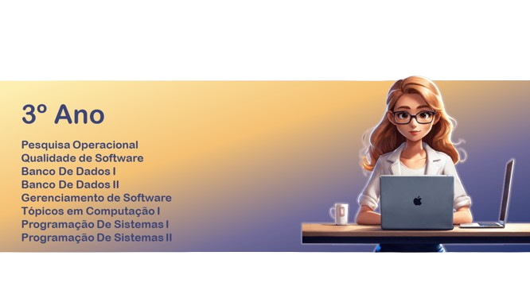
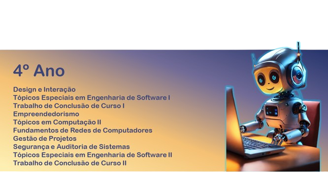

## ROADMAP: ENGENHEIRO DE SOFTWARE 🚀

### 1º Ano - Series 1 a 4

**Série 1: Fundamentos Iniciais**

Esta série introdutória visa estabelecer as bases essenciais para o desenvolvimento acadêmico e pessoal dos estudantes, abordando desde aspectos relacionados à administração de conflitos e relacionamentos até os fundamentos da arquitetura de computadores. Além disso, inclui uma disciplina dedicada ao desenvolvimento pessoal e profissional por meio do projeto de vida, bem como o aprendizado básico da Língua Brasileira de Sinais (LIBRAS), promovendo a inclusão e a comunicação acessível.

**Administração de Conflitos e Relacionamentos:**
1. Identificação de tipos de conflitos interpessoais e estratégias para resolução pacífica.
2. Desenvolvimento de habilidades de comunicação e negociação.
3. Construção de relacionamentos saudáveis e produtivos no ambiente acadêmico e profissional.
4. Aplicação de técnicas de mediação e conciliação em situações de conflito.
5. Promoção da empatia e do entendimento mútuo em relações interpessoais.

**Fundamentos e Arquitetura de Computadores:**
1. Compreensão dos princípios básicos da arquitetura de computadores: CPU, memória, entrada/saída.
2. Estudo dos componentes fundamentais de um sistema computacional e suas interações.
3. Análise de diferentes arquiteturas de processadores e sistemas computacionais.
4. Exploração dos conceitos de hardware e software e sua relação na execução de tarefas computacionais.
5. Reconhecimento da importância da arquitetura de computadores no desenvolvimento de software eficiente e na otimização de recursos.

**Série 2: Introdução à Programação e Identificação de Oportunidades**

Esta série concentra-se nos fundamentos da programação e no desenvolvimento de habilidades lógicas e algorítmicas essenciais para a resolução de problemas computacionais. Além disso, inclui uma disciplina dedicada à identificação de oportunidades, estimulando o empreendedorismo e a visão estratégica para a detecção de demandas e necessidades no mercado.

**Algoritmos e Lógica de Programação I:**
1. Introdução aos conceitos básicos de algoritmos e programação.
2. Desenvolvimento de habilidades de pensamento lógico e análise de problemas.
3. Estudo de estruturas de controle de fluxo: sequencial, condicional e repetitiva.
4. Implementação de algoritmos simples em uma linguagem de programação de alto nível.
5. Resolução de problemas práticos por meio da aplicação de algoritmos.

**Algoritmos e Lógica de Programação II:**
1. Continuação do estudo de algoritmos com foco em estruturas de dados mais complexas.
2. Exploração de algoritmos de ordenação, busca e manipulação de vetores e matrizes.
3. Utilização de funções e procedimentos para modularizar o código e facilitar a manutenção.
4. Implementação de algoritmos recursivos e sua aplicação em problemas computacionais.
5. Desenvolvimento de projetos práticos envolvendo algoritmos mais elaborados.

**Série 3: Fundamentos de Engenharia de Software e Estatística Aplicada**

Esta série aborda conceitos fundamentais da Engenharia de Software, estatística aplicada à computação e preparação para oportunidades profissionais. A Engenharia de Software é essencial para o desenvolvimento de sistemas de software robustos e de alta qualidade, enquanto a estatística fornece ferramentas importantes para a análise e interpretação de dados. A disciplina de preparação para oportunidades visa capacitar os estudantes para enfrentar desafios e aproveitar oportunidades em suas carreiras.

**Engenharia de Software:**
1. Introdução aos princípios e práticas da Engenharia de Software.
2. Estudo dos modelos de ciclo de vida de desenvolvimento de software: cascata, incremental, ágil, entre outros.
3. Análise de requisitos, projeto, implementação, teste e manutenção de software.
4. Exploração de metodologias ágeis, como Scrum e Kanban, e suas aplicações práticas.
5. Discussão sobre qualidade de software, garantia de qualidade e gerenciamento de configuração.

**Estatística:**
1. Conceitos básicos de estatística descritiva e inferencial.
2. Análise de distribuições de frequência, medidas de tendência central e dispersão.
3. Estudo de probabilidade, distribuições de probabilidade e intervalos de confiança.
4. Aplicação de testes de hipóteses e técnicas de amostragem em análises estatísticas.
5. Utilização de ferramentas estatísticas e software para análise e visualização de dados.

**Série 4: Análise e Projeto Orientado a Objetos, Engenharia de Requisitos e Oportunidades Profissionais**

A série 4 foca na aplicação prática de conceitos avançados de desenvolvimento de software, desde a análise e projeto orientado a objetos até a engenharia de requisitos. Além disso, inclui uma disciplina voltada para a exploração de oportunidades profissionais e a obtenção de resultados concretos na carreira.

**Análise e Projeto Orientado a Objetos:**
1. Estudo aprofundado dos princípios de orientação a objetos: encapsulamento, herança, polimorfismo, entre outros.
2. Aplicação de técnicas de modelagem de sistemas utilizando diagramas UML (Unified Modeling Language).
3. Desenvolvimento de habilidades de análise e projeto de software orientado a objetos.
4. Exploração de padrões de projeto (design patterns) para solução de problemas comuns em desenvolvimento de software.
5. Implementação de projetos práticos utilizando linguagens e ferramentas orientadas a objetos.

**Engenharia de Requisitos:**
1. Compreensão dos processos e técnicas para elicitação, análise, especificação e validação de requisitos de software.
2. Utilização de ferramentas e metodologias para captura e documentação de requisitos, como entrevistas, questionários e prototipagem.
3. Análise de requisitos não funcionais, como desempenho, segurança e usabilidade.
4. Discussão sobre técnicas de validação de requisitos e garantia da qualidade.
5. Aplicação de práticas ágeis na gestão de requisitos e adaptação a mudanças durante o ciclo de vida do software.

### 2º Ano - Series 5 a 8

**Série 5: Lógica para Computação e Modelagem de Software**

A série 5 concentra-se na construção de uma base sólida em lógica computacional e na aplicação de técnicas de modelagem para o desenvolvimento de software.

**Lógica para Computação:**
1. Fundamentos da lógica proposicional e de predicados.
2. Introdução à teoria dos conjuntos e álgebra booleana.
3. Aplicações da lógica na programação de computadores, incluindo estruturas de controle e algoritmos.
4. Resolução de problemas utilizando técnicas de raciocínio lógico e dedução.
5. Desenvolvimento de habilidades de pensamento crítico e análise de problemas computacionais.

**Modelagem de Software:**
1. Estudo dos conceitos e técnicas de modelagem de software.
2. Utilização de diagramas UML para representação visual de sistemas de software.
3. Análise e especificação de requisitos através de modelos de casos de uso, classes e sequência.
4. Desenvolvimento de diagramas de atividades, estados e componentes para modelagem de processos e arquiteturas de software.
5. Aplicação de práticas de modelagem para comunicação eficaz entre equipes de desenvolvimento e stakeholders.

**Série 6: Estrutura de Dados I e II**

A série 6 explora os fundamentos das estruturas de dados, essenciais para a organização e manipulação eficiente de informações em sistemas de software.

**Estrutura de Dados I:**
1. Introdução às estruturas de dados lineares, como listas, pilhas e filas.
2. Implementação e análise de algoritmos de busca e ordenação em estruturas de dados lineares.
3. Estudo das estruturas de dados não lineares, incluindo árvores e grafos.
4. Aplicação de estruturas de dados em problemas práticos de programação.
5. Discussão sobre eficiência de algoritmos e análise de complexidade.

**Estrutura de Dados II:**
1. Aprofundamento nas estruturas de dados avançadas, como árvores balanceadas e tabelas hash.
2. Análise de algoritmos de pesquisa e manipulação em estruturas de dados complexas.
3. Exploração de estratégias de otimização e implementação eficiente de algoritmos.
4. Estudo de algoritmos para problemas específicos, como grafos ponderados e algoritmos de caminho mais curto.
5. Desenvolvimento de projetos práticos envolvendo a aplicação de estruturas de dados em contextos reais de desenvolvimento de software.

**Série 7: Paradigmas de Linguagem de Programação e Projeto, Implementação e Teste de Software**

A série 7 foca na compreensão e aplicação dos diferentes paradigmas de programação, bem como nas práticas de projeto, implementação e teste de software.

**Paradigmas de Linguagem de Programação:**
1. Exploração dos principais paradigmas de programação, como imperativo, funcional, orientado a objetos e lógico.
2. Compreensão das características e conceitos fundamentais de cada paradigma.
3. Análise comparativa de linguagens de programação que suportam diferentes paradigmas.
4. Aplicação dos conceitos aprendidos na resolução de problemas utilizando diferentes paradigmas.
5. Discussão sobre tendências e novidades em paradigmas de programação emergentes.

**Projeto, Implementação e Teste de Software:**
1. Estudo dos processos e metodologias de desenvolvimento de software, como o ciclo de vida do software e métodos ágeis.
2. Práticas de elicitação e análise de requisitos para projetos de software.
3. Planejamento e arquitetura de sistemas de software, incluindo design de software e padrões de projeto.
4. Implementação de software seguindo as boas práticas de codificação e controle de qualidade.
5. Estratégias e técnicas de teste de software, incluindo testes unitários, integrados e de aceitação, além de automação de testes.

**Série 8: Cálculo Diferencial e Integral e Sistemas Operacionais**

A série 8 aborda conceitos fundamentais de cálculo e sistemas operacionais, essenciais para a compreensão e aplicação de princípios avançados em ciência da computação.

**Cálculo Diferencial e Integral:**
1. Introdução aos conceitos de limite, derivada e integral.
2. Aplicações do cálculo na computação, como análise de algoritmos e otimização.
3. Estudo das técnicas de diferenciação e integração de funções.
4. Análise de séries e sequências infinitas.
5. Aplicação do cálculo em problemas práticos de ciência da computação, como simulações e modelagem matemática.

**Sistemas Operacionais:**
1. Compreensão dos princípios e funcionalidades dos sistemas operacionais.
2. Estudo dos componentes dos sistemas operacionais, incluindo processos, gerenciamento de memória e sistemas de arquivos.
3. Análise dos algoritmos de escalonamento de processos e gerenciamento de recursos.
4. Exploração dos diferentes tipos de sistemas operacionais, como monolíticos, em camadas e microkernels.
5. Discussão sobre aspectos de segurança, virtualização e computação distribuída em sistemas operacionais modernos.

### 3º Ano - Series 9 a 12

**Série 9: Estudo Contemporâneo e Transversal, Formação Sociocultural e Ética, Pesquisa Operacional e Qualidade de Software**

A série 9 aborda aspectos essenciais para o desenvolvimento profissional e ético do engenheiro de software, além de fornecer ferramentas para análise e otimização de processos.

**Estudo Contemporâneo e Transversal: Leitura de Imagens, Gráficos e Mapas:**
1. Desenvolvimento da habilidade de interpretar e analisar informações visuais, como imagens, gráficos e mapas.
2. Utilização de ferramentas e técnicas para extrair conhecimento de dados visuais.
3. Aplicação da leitura de imagens, gráficos e mapas em diferentes contextos, como ciência de dados e geoprocessamento.
4. Discussão sobre a importância da alfabetização visual na sociedade contemporânea.
5. Análise crítica de representações visuais e sua influência na percepção e comunicação de informações.

**Formação Sociocultural e Ética I e II:**
1. Reflexão sobre aspectos éticos, culturais e sociais relacionados à prática da engenharia de software.
2. Estudo de casos e dilemas éticos comuns na área de tecnologia da informação.
3. Discussão sobre a responsabilidade social do engenheiro de software e seu impacto na sociedade.
4. Análise de questões de diversidade, inclusão e equidade no ambiente de trabalho.
5. Desenvolvimento de habilidades de comunicação e trabalho em equipe considerando aspectos socioculturais.

**Pesquisa Operacional:**
1. Introdução aos conceitos e técnicas de pesquisa operacional aplicados à otimização de processos.
2. Estudo de modelos matemáticos para tomada de decisão em situações complexas.
3. Aplicação de métodos quantitativos para análise e resolução de problemas de otimização.
4. Utilização de ferramentas computacionais para modelagem e simulação de processos.
5. Discussão sobre aplicações práticas da pesquisa operacional em diferentes áreas, como logística, produção e finanças.

**Qualidade de Software:**
1. Compreensão dos conceitos e práticas relacionadas à qualidade de software.
2. Estudo dos modelos de qualidade e padrões de qualidade reconhecidos internacionalmente.
3. Aplicação de técnicas de garantia e controle de qualidade ao longo do ciclo de vida do software.
4. Utilização de métricas e indicadores para avaliação da qualidade do software.
5. Análise de casos de estudo e melhores práticas em garantia da qualidade de software.

**Série 11: Estudo Contemporâneo e Transversal: Inteligência Emocional, Gerenciamento de Software e Tópicos em Computação I**

A série 11 aborda aspectos relacionados ao desenvolvimento pessoal e profissional do engenheiro de software, incluindo habilidades emocionais e técnicas avançadas de gerenciamento de projetos e tópicos específicos em computação.

**Estudo Contemporâneo e Transversal: Inteligência Emocional:**
1. Desenvolvimento de habilidades emocionais essenciais para o ambiente profissional, como empatia, autoconhecimento e automotivação.
2. Reconhecimento e gestão de emoções no contexto de trabalho e relacionamentos interpessoais.
3. Aplicação da inteligência emocional na resolução de conflitos e na liderança de equipes.
4. Importância da inteligência emocional para o bem-estar pessoal e profissional.
5. Discussão sobre estratégias para o desenvolvimento contínuo da inteligência emocional ao longo da carreira.

**Gerenciamento de Software:**
1. Estudo dos princípios e práticas de gerenciamento de projetos de software, incluindo metodologias ágeis e tradicionais.
2. Utilização de ferramentas e técnicas para planejamento, execução, monitoramento e controle de projetos de software.
3. Análise de casos de estudo e melhores práticas em gerenciamento de software.
4. Abordagem de temas como gestão de riscos, comunicação eficaz e liderança de equipes de desenvolvimento.
5. Discussão sobre a importância do gerenciamento de software para o sucesso dos projetos e a satisfação do cliente.

**Tópicos em Computação I:**
1. Exploração de temas avançados e emergentes em computação.
2. Estudo de tecnologias, tendências e desafios atuais na área de TI.
3. Análise de casos de uso e aplicações práticas de novas tecnologias e paradigmas computacionais.
4. Discussão sobre ética e responsabilidade social relacionadas à adoção de novas tecnologias.
5. Desenvolvimento de habilidades de pesquisa e análise crítica para avaliação de tópicos em computação.

### 4º Ano - Series 13 a 16

**Série 13: Design e Interação, Estudo Contemporâneo e Transversal: Gestão do Conhecimento, Tópicos Especiais em Engenharia de Software I e Trabalho de Conclusão de Curso I**

A série 13 é voltada para a aplicação de conhecimentos avançados em design, gestão do conhecimento, tópicos específicos em engenharia de software e elaboração do trabalho de conclusão de curso.

**Design e Interação:**
1. Exploração dos princípios de design centrado no usuário e experiência do usuário (UX).
2. Desenvolvimento de habilidades para criação de interfaces intuitivas e atraentes.
3. Estudo de ferramentas e técnicas de prototipagem e design de interação.
4. Análise de casos de sucesso e tendências em design de interfaces.
5. Importância do design e da interação para a usabilidade e aceitação de sistemas de software.

**Estudo Contemporâneo e Transversal: Gestão do Conhecimento:**
1. Compreensão dos conceitos fundamentais de gestão do conhecimento nas organizações.
2. Análise de estratégias para a captura, armazenamento, compartilhamento e aplicação do conhecimento organizacional.
3. Estudo de ferramentas e tecnologias para gestão do conhecimento, como sistemas de gestão de documentos e bases de conhecimento.
4. Discussão sobre o papel da cultura organizacional e das lideranças na gestão do conhecimento.
5. Importância da gestão do conhecimento para a inovação, competitividade e sustentabilidade das organizações.

**Tópicos Especiais em Engenharia de Software I:**
1. Exploração de temas avançados e especializados em engenharia de software.
2. Estudo de metodologias, tecnologias e práticas emergentes na área de desenvolvimento de software.
3. Análise crítica de pesquisas e tendências recentes em engenharia de software.
4. Desenvolvimento de habilidades de investigação e síntese de informações técnicas.
5. Aplicação de conceitos aprendidos em projetos práticos e desafios reais de engenharia de software.

**Trabalho de Conclusão de Curso I:**
1. Elaboração e planejamento do projeto de pesquisa para o trabalho de conclusão de curso.
2. Definição do tema, objetivos, metodologia e cronograma de trabalho.
3. Revisão bibliográfica e levantamento do estado da arte relacionado ao tema escolhido.
4. Desenvolvimento do embasamento teórico e justificativa do trabalho.
5. Preparação da proposta de trabalho de conclusão de curso para avaliação e aprovação.

**Série 14: Empreendedorismo, Estudo Contemporâneo e Transversal: Comunicação Assertiva e Interpessoal, Tópicos em Computação II**

A série 14 aborda disciplinas essenciais para o desenvolvimento de habilidades empreendedoras, comunicação interpessoal eficaz e conhecimentos específicos em computação.

**Empreendedorismo:**
1. Estudo dos princípios fundamentais do empreendedorismo e sua aplicação em diferentes contextos.
2. Desenvolvimento de habilidades de identificação e avaliação de oportunidades de negócios.
3. Análise de casos de sucesso e fracasso em empreendedorismo.
4. Exploração de estratégias de planejamento, gestão e crescimento de startups.
5. Importância do empreendedorismo para a inovação, geração de empregos e crescimento econômico.

**Estudo Contemporâneo e Transversal: Comunicação Assertiva e Interpessoal:**
1. Compreensão dos princípios da comunicação interpessoal e sua importância nas relações profissionais e pessoais.
2. Desenvolvimento de habilidades de expressão oral e escrita, escuta ativa e feedback construtivo.
3. Análise de técnicas de comunicação assertiva e resolução de conflitos.
4. Exploração de estratégias para melhorar a comunicação em diferentes contextos e públicos.
5. Importância da comunicação assertiva para o trabalho em equipe, liderança e sucesso profissional.

**Tópicos em Computação II:**
1. Exploração de temas avançados e especializados em computação.
2. Estudo de tecnologias emergentes e tendências recentes na área de computação.
3. Análise crítica de pesquisas e aplicações práticas em computação.
4. Desenvolvimento de habilidades de resolução de problemas e pensamento computacional avançado.
5. Aplicação de conceitos aprendidos em projetos práticos e desafios reais de computação.

**Série 15: Estudo Contemporâneo e Transversal: Gestão de Indicadores, Fundamentos de Redes de Computadores, Gestão de Projetos**

A série 15 aborda disciplinas cruciais para a compreensão da gestão de indicadores, fundamentos das redes de computadores e gestão de projetos.

**Estudo Contemporâneo e Transversal: Gestão de Indicadores:**
1. Exploração dos conceitos fundamentais de indicadores e métricas.
2. Compreensão da importância dos indicadores na avaliação de desempenho e tomada de decisões.
3. Análise de diferentes tipos de indicadores, como financeiros, operacionais e de qualidade.
4. Desenvolvimento de habilidades para coletar, analisar e interpretar dados para elaboração de indicadores.
5. Aplicação prática de técnicas de gestão de indicadores em diversos contextos organizacionais.

**Fundamentos de Redes de Computadores:**
1. Introdução aos princípios básicos de redes de computadores.
2. Estudo dos modelos de arquitetura de redes, como OSI e TCP/IP.
3. Compreensão dos protocolos de comunicação e suas funcionalidades.
4. Análise dos componentes de uma rede, incluindo hardware, software e infraestrutura.
5. Exploração de tecnologias emergentes e tendências na área de redes de computadores.

**Gestão de Projetos:**
1. Estudo das metodologias e ferramentas utilizadas na gestão de projetos.
2. Compreensão dos processos de planejamento, execução, controle e encerramento de projetos.
3. Análise dos principais desafios e riscos enfrentados na gestão de projetos.
4. Desenvolvimento de habilidades de liderança, comunicação e trabalho em equipe.
5. Aplicação prática de técnicas de gestão de projetos em cenários reais, visando alcançar os objetivos definidos.

**Série 16: Estudo Contemporâneo e Transversal: Compliance, Segurança e Auditoria de Sistemas, Tópicos Especiais em Engenharia de Software II, Trabalho de Conclusão de Curso II**

A série 16 aborda disciplinas avançadas relacionadas ao compliance, segurança de sistemas, tópicos especiais em engenharia de software e a finalização do trabalho de conclusão de curso.

**Estudo Contemporâneo e Transversal: Compliance:**
1. Exploração dos princípios e práticas de compliance em organizações.
2. Compreensão das regulamentações e normas aplicáveis, como GDPR, LGPD, ISO 27001, entre outras.
3. Análise dos processos de conformidade e gestão de riscos relacionados à segurança da informação e proteção de dados.
4. Estudo dos papéis e responsabilidades dos profissionais de compliance nas empresas.
5. Aplicação prática de estratégias para garantir a conformidade com as leis e regulamentos pertinentes.

**Segurança e Auditoria de Sistemas:**
1. Introdução aos conceitos de segurança da informação e sua importância nas organizações.
2. Estudo das principais ameaças e vulnerabilidades de sistemas de informação.
3. Exploração das técnicas e ferramentas de auditoria de sistemas para identificação e mitigação de riscos.
4. Análise das práticas recomendadas para proteção de dados, prevenção de ataques cibernéticos e resposta a incidentes de segurança.
5. Desenvolvimento de habilidades para implementação e monitoramento de políticas de segurança em ambientes corporativos.

**Tópicos Especiais em Engenharia de Software II:**
1. Abordagem de temas avançados e emergentes na área de engenharia de software.
2. Exploração de metodologias ágeis, DevOps, inteligência artificial aplicada ao desenvolvimento de software, entre outros.
3. Análise de casos de estudo e experiências práticas de empresas líderes no mercado de tecnologia.
4. Discussão sobre tendências e desafios futuros no desenvolvimento de software.
5. Aplicação de técnicas avançadas de engenharia de software em projetos reais.

**Trabalho de Conclusão de Curso II:**
1. Continuação do desenvolvimento do trabalho de conclusão de curso iniciado na série anterior.
2. Refinamento da pesquisa, coleta de dados e análise de resultados.
3. Elaboração da monografia ou relatório técnico-científico conforme as normas estabelecidas pela instituição de ensino.
4. Preparação para apresentação e defesa do trabalho perante uma banca examinadora.
5. Conclusão do curso de graduação com a entrega e aprovação do trabalho de conclusão de curso.
